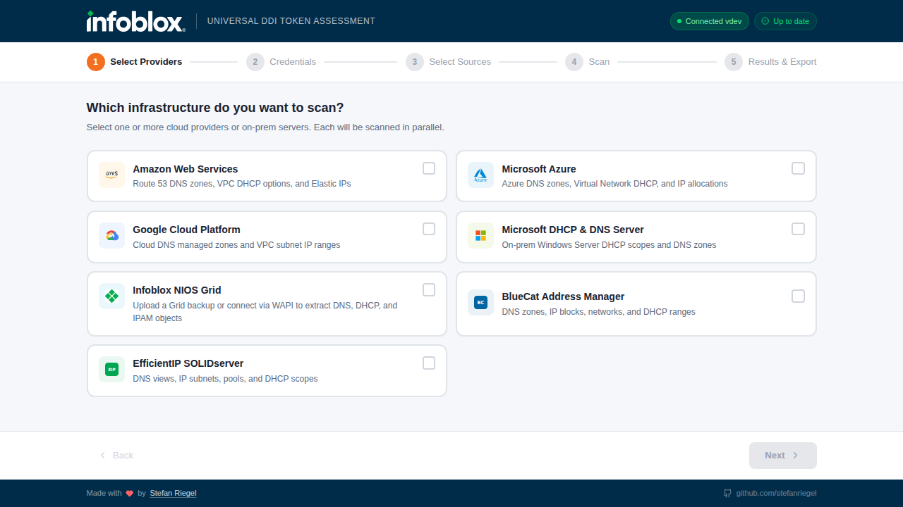

# Universal Token Assessment


Estimates Infoblox Universal DDI management tokens by scanning your existing infrastructure — cloud providers, Active Directory, NIOS Grids, and third-party DDI systems. Single self-contained binary with an embedded web UI.



## Installation

### Windows

```powershell
irm https://raw.githubusercontent.com/stefanriegel/Universal-Token-Assessment/main/scripts/install.ps1 | iex
```

<details>
<summary>Manual download</summary>

1. Download `universal-token-assessment_windows_amd64.exe` from the [latest release](https://github.com/stefanriegel/Universal-Token-Assessment/releases/latest)
2. Unblock the file: right-click → Properties → check **Unblock** → OK
3. Double-click or run from terminal

</details>

### macOS

```bash
brew tap stefanriegel/tap
brew install universal-token-assessment
```

<details>
<summary>Shell script (alternative)</summary>

```bash
curl -sL https://raw.githubusercontent.com/stefanriegel/Universal-Token-Assessment/main/scripts/install.sh | sh
```

</details>

### Linux

```bash
curl -sL https://raw.githubusercontent.com/stefanriegel/Universal-Token-Assessment/main/scripts/install.sh | sh
```

All install methods support auto-update — the app checks for new versions on launch and updates in-place. In Docker environments, self-update is disabled and the UI shows a link to the latest release instead.

## Docker / Server Deployment

Run the calculator on a server so any browser on the network can reach it — no local install needed on client machines.

### Quick start (single container)

```bash
docker run -d -p 8080:8080 --restart unless-stopped ghcr.io/stefanriegel/universal-token-assessment:latest
```

Then open `http://<server-ip>:8080` in any browser on the network.

### Docker Compose (recommended)

**Option A — download the Compose file:**

```bash
curl -O https://raw.githubusercontent.com/stefanriegel/Universal-Token-Assessment/main/docker-compose.yml
docker compose up -d
```

**Option B — clone the repo:**

```bash
git clone https://github.com/stefanriegel/Universal-Token-Assessment.git
cd Universal-Token-Assessment
docker compose up -d
```

### Verify the container is healthy

```bash
curl http://localhost:8080/api/v1/health
```

Expected response:

```json
{"status":"ok","version":"...","platform":"linux"}
```

`docker compose ps` shows **healthy** within ~40 seconds of startup.

### Port mapping

The container listens on port **8080**. To map a different host port:

```bash
docker run -d -p <host-port>:8080 --restart unless-stopped ghcr.io/stefanriegel/universal-token-assessment:latest
```

> **Note:** The container side must remain `8080` — the built-in healthcheck probes `localhost:8080`.

## Usage

```bash
universal-token-assessment
```

The web UI opens automatically in your default browser. From there:

1. **Select providers** — Choose which infrastructure to scan
2. **Enter credentials** — Authenticate to each provider (credentials stay in-memory)
3. **Configure sources** — Select accounts, subscriptions, Grid Members, or DCs to scan
4. **Scan & review** — Token estimates, migration planner, Excel export

## Windows Security Note

The binary is not code-signed. Windows SmartScreen may warn on first run — click **More info** → **Run anyway**. The PowerShell installer calls `Unblock-File` automatically.

## Supported Providers

| Provider | Auth Methods | Discovers |
|----------|-------------|-----------|
| **AWS** | Access Key, SSO, CLI Profile, Assume Role, Organizations | VPCs, subnets, Route53 zones/records (per-type), EC2, ELBs, NICs, NAT/IGW/TGW, IPAM, VPN, resolver endpoints |
| **Azure** | Service Principal, Browser SSO, CLI (`az login`), Certificate, Device Code | VNets, subnets, DNS zones/records (per-type), VMs, LBs, App Gateways, public IPs, firewalls, private endpoints, VNet gateways |
| **GCP** | Service Account JSON, ADC, Browser OAuth, Workload Identity Federation | VPCs, subnets, Cloud DNS zones/records (per-type), compute instances, LBs, addresses, firewalls, routers, VPN gateways/tunnels, GKE CIDRs |
| **Active Directory** | WinRM (NTLM), WinRM (Kerberos), HTTPS | DNS zones/records, DHCP scopes/leases/reservations, users, computers, static IPs |
| **NIOS Grid** | Backup upload (`.tar.gz` / `.tgz` / `.bak`) | Per-member DNS, DHCP, IPAM, DTC objects, QPS/LPS, managed IPs, static/dynamic hosts, DHCP utilization, licenses |
| **NIOS WAPI** | Username / Password | Capacity report, per-member DDI totals |
| **Bluecat** | Username / Password (v2 API with v1 fallback) | DNS views/zones/records, IPAM blocks/networks/addresses, DHCP ranges |
| **EfficientIP** | Username / Password (Basic + native fallback) | DNS views/zones/records, IPAM sites/subnets/pools, DHCP scopes/ranges |

## Building from Source

<details>
<summary>Development setup</summary>

**Prerequisites:** Go 1.24+, Node.js 18+, pnpm

```bash
git clone https://github.com/stefanriegel/Universal-Token-Assessment.git
cd Universal-Token-Assessment

# Build frontend (required — Go embeds frontend/dist at compile time)
cd frontend && pnpm install && pnpm build && cd ..

# Build binary
CGO_ENABLED=0 go build -ldflags="-s -w" -o universal-token-assessment .
```

**Windows build** (requires mingw-w64 for SSPI support):

```bash
CGO_ENABLED=1 CC=x86_64-w64-mingw32-gcc GOOS=windows GOARCH=amd64 \
  go build -ldflags="-s -w" -o universal-token-assessment.exe .
```

**Run tests:**

```bash
go test ./... -count=1
```

</details>

### Dev Channel

<details>
<summary>Pre-release builds for testing</summary>

```powershell
# Windows
& ([scriptblock]::Create((irm https://raw.githubusercontent.com/stefanriegel/Universal-Token-Assessment/main/scripts/install.ps1))) -Channel dev
```

```bash
# macOS / Linux
curl -sL https://raw.githubusercontent.com/stefanriegel/Universal-Token-Assessment/main/scripts/install.sh | sh -s -- --channel dev
```

</details>

## License

All rights reserved. This software is proprietary.
